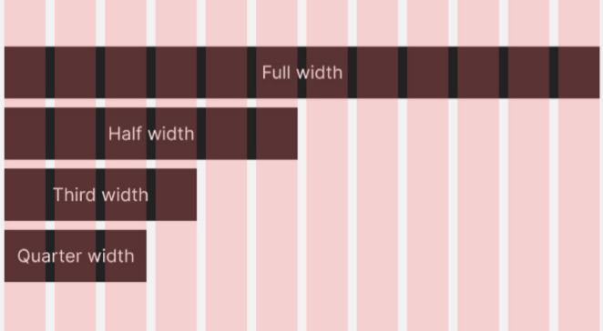
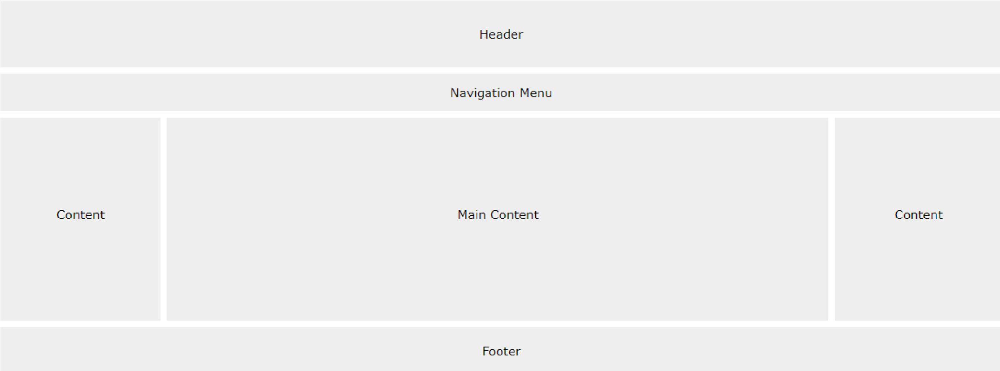
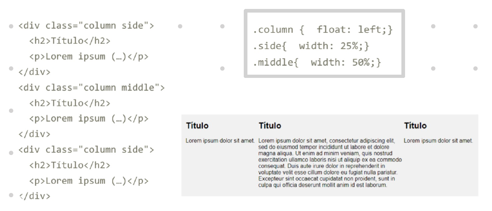
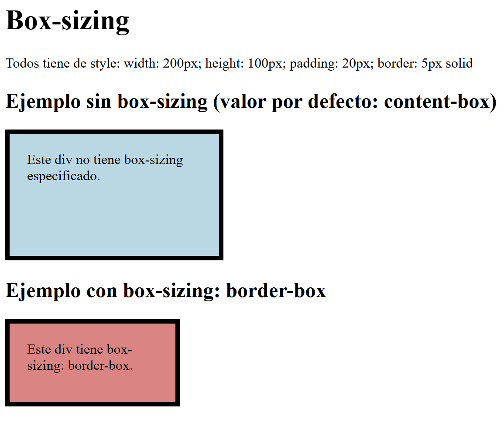

# Apuntes de CSS

Aquí tienes un índice con enlaces a las secciones de tu README para facilitar la navegación:

## Índice
1. [Selectores simples](#selectores-simples)
    1.1. [Selector por nombre de un elemento](#1-selector-por-nombre-de-un-elemento)  
    1.2. [Selector de ID](#2-selector-de-id)  
    1.3. [Selector por atributo de un elemento](#3-selector-por-atributo-de-un-elemento)  
    1.4. [Selector por nombre de clase](#4-selector-por-nombre-de-clase)  
    1.5. [Selector por clase y atributo](#5-selector-por-clase-y-atributo)  
    1.6. [Selector universal](#6-selector-universal)  
    1.7. [Selector de agrupación](#7-selector-de-agrupación)  

2. [Selectores de Combinación](#selectores-de-combinación)
    2.1. [Selector de Descendiente](#1-selector-de-descendiente-)  
    2.2. [Selector de Hijo](#2-selector-de-hijo-)  
    2.3. [Selector de Hermano Adyacente](#3-selector-de-hermano-adyacente-)  
    2.4. [Selector de Hermano General](#4-selector-de-hermano-general-)  

3. [Pseudo-clases](#pseudo-clases)

4. [Declaraciones](#declaraciones)
    4.1. [Sintaxis Margin](#1-sintaxis-margin)  
    4.2. [Sintaxis border](#2-sintaxis-border)  
    4.3. [Sintaxis padding](#3-sintaxis-padding)  
    4.4. [Sintaxis content](#4-sintaxis-content)  

5. [CSS para texto](#css-para-texto)  
6. [CSS para font-family](#css-para-font-family)  
7. [CSS de position](#css-de-position)  
8. [Unidades](#unidades)  
9. [Colores](#colores)  

10. [Especificidad en CSS](#especificidad-en-css)  
11. [Uso de `!important`](#uso-de-important)  

12. [Recomendaciones de Diseño](#recomendaciones-de-diseño)  
13. [Elementos Básicos de Diseño](#elementos-básicos-de-diseño)  
    13.1. [Nav](#nav)  
    13.2. [Columnas](#columnas)  
    13.3. [Box-sizing](#box-sizing)  

14. [Grid y Flex](#grid-y-flex)  
    14.1. [Grid: diseño con 2 dimensiones](#grid-diseño-con-2-dimensiones)  
    14.2. [Ubicación de elementos dentro del grid](#ubicación-de-elementos-dentro-del-grid)  
    14.3. [Propiedades adicionales de Grid](#propiedades-adicionales-de-grid)  


## Selectores simples

### 1. Selector por nombre de un elemento

Selecciona todos los elementos del tipo especificado.

```css
/* Selecciona todos los párrafos <p> */
p {
  color: blue;
}
```

#### Ejemplo:
```html
<p>Este texto será azul.</p>
```

---
### 2. Selector de ID
Selecciona un solo elemento con un id específico. Los id se identifican con una almohadilla (#) antes del nombre.

```css
/* Selecciona el elemento con el id "miElemento" */
#miElemento {
  color: green;
}
```

#### Ejemplo:
```html
<p id="miElemento">Este texto será VERDE .</p>
```

---

### 3. Selector por atributo de un elemento

Selecciona elementos que contienen un atributo específico.

```css
/* Selecciona todos los elementos con el atributo "title" */
[title] {
  border: 1px solid black;
}

/* Selecciona todos los elementos cuyo atributo "href" contiene "https" */
a[href*="https"] {
  text-decoration: underline;
}
```

#### Ejemplo:
```html
<a href="https://example.com" title="Ejemplo">Link con HTTPS</a>
```

---

### 4. Selector por nombre de clase

Selecciona elementos que tienen una clase específica. Las clases se definen con un punto (`.`) seguido del nombre de la clase.

```css
/* Selecciona todos los elementos con la clase "destacado" */
.destacado {
  background-color: yellow;
}
```

#### Ejemplo:
```html
<p class="destacado">Este texto tiene un fondo amarillo.</p>
```

---

### 5. Selector por clase y atributo

Selecciona elementos que cumplen con una clase y un atributo específico.

```css
/* Selecciona elementos con la clase "activo" y el atributo "data-status" */
.activo[data-status="enabled"] {
  font-weight: bold;
}
```

#### Ejemplo:
```html
<div class="activo" data-status="enabled">Texto importante</div>
```

---

### 6. Selector universal

Selecciona **todos** los elementos de la página.

```css
/* Aplica un margen a todos los elementos */
* {
  margin: 0;
  padding: 0;
}
```

#### Ejemplo:
```html
<p>Este texto no tendrá margen ni padding.</p>
```

---

### 7. Selector de agrupación

Permite aplicar los mismos estilos a múltiples selectores. Se agrupan usando comas.

```css
/* Aplica el mismo estilo a h1, h2 y h3 */
h1, h2, h3 {
  font-family: Arial, sans-serif;
}
```

#### Ejemplo:
```html
<h1>Título 1</h1>
<h2>Título 2</h2>
<h3>Título 3</h3>
```

---

## Selectores de Combinación

### 1. Selector de Descendiente (` `)

Selecciona todos los elementos que están **dentro** de otro elemento, sin importar el nivel de profundidad.

```css
/* Selecciona todos los <p> dentro de un <div> con id "div_descendiente" */
#div_descendiente p {
  color: green;
}
```

#### Ejemplo:
```html
<div id="div_descendiente">
  <p>Este texto será verde.</p>
  <span>
    <p>Este texto también será verde.</p>
  </span>
</div>
```

---

### 2. Selector de Hijo (`>`)

Selecciona solo los elementos que son **hijos directos** de un elemento.

```css
/* Selecciona solo los <p> que son hijos directos de un <div> con id "div_hijo" */
#div_hijo > p {
  color: blue;
}
```

#### Ejemplo:
```html
<div id="div_hijo">
  <p>Este texto será azul.</p>
  <span>
    <p>Este texto no será azul.</p>
  </span>
</div>
```

---

### 3. Selector de Hermano Adyacente (`+`)

Selecciona el **primer hermano inmediato** que aparece después del elemento especificado.

```css
/* Selecciona el <p> que sigue inmediatamente a un <div> con id "div_hermanoAdyacente" */
#div_hermanoAdyacente + p {
  color: red;
}
```

#### Ejemplo:
```html
<div id="div_hermanoAdyacente">Este es un div.</div>
<p>Este texto será rojo.</p>
<p>Este texto no será rojo.</p>
```

---

### 4. Selector de Hermano General (`~`)

Selecciona todos los elementos hermanos que vienen después de un elemento especificado, sin importar si son adyacentes.

```css
/* Selecciona todos los <p> que son hermanos posteriores de un <div> con id "div_hermanoGeneral" */
#div_hermanoGeneral ~ p {
  color: purple;
}
```

#### Ejemplo:
```html
<div id="div_hermanoGeneral">Este es un div.</div>
<p>Este texto será morado.</p>
<p>Este también será morado.</p>
<span>Este no será afectado porque no es un <p>.</span>
```

---

## Pseudo-clases
Sintaxis: 
```
selector:pesudo-class{}
```

- :hover --> Selecciona al elemento que tiene el **ratón** encima
    ```css
    /* Cambia el color de fondo cuando el ratón pasa sobre el botón */
    button:hover {
    background-color: lightblue;
    }
    ```
    ```html
    <button>Hover sobre mí</button>
    ```
- :focus --> Selecciona al elemento que tiene el **foco**
    ```css
    /* Cambia el borde cuando el campo de texto tiene el foco */
    input:focus {
    border-color: blue;
    }
    ```
    ```html
    <input type="text" placeholder="Haz clic aquí">
    ```
- :first-child --> Seleccional al **primer hijo**
    ```css
    /* Cambia el color del primer párrafo dentro de un div */
    div p:first-child {
    color: red;
    }
    ```
    ```html
    <div>
    <p>Este es el primer párrafo.</p>
    <p>Este no será rojo.</p>
    </div>
    ```
- :last-child --> Selecciona al **segundo hijo**
    ```css
    /* Cambia el color del último párrafo dentro de un div */
    div p:last-child {
    color: green;
    }
    ```
    ```html
    <div>
    <p>Este no será verde.</p>
    <p>Este sí será verde.</p>
    </div>
    ```
---

## Declaraciones

- **margin**: Espacio fuera del borde del elemento.
- **border**: Borde alrededor del elemento.
- **padding**: Espacio dentro del borde, entre el borde y el contenido.
- **content**: Permite agregar contenido antes o después de un elemento con los pseudo-elementos ::before y ::after.

### 1. Sintaxis Margin
```css
/* Establece márgenes en los 4 lados del elemento */
margin: 10px;  /* Mismo margen en todos los lados */

/* Márgenes distintos en cada lado */
margin: 10px 20px 30px 40px; /* superior, derecho, inferior, izquierdo */
```

### 2. Sintaxis border
```css
/* Borde con grosor, estilo y color */
border: 2px solid black;

/* Borde específico por lado */
border-top: 2px solid red;
border-right: 2px dashed green;
border-bottom: 2px dotted blue;
border-left: 2px solid yellow;
```

### 3. Sintaxis padding
```css
/* Establece el relleno en todos los lados */
padding: 10px;

/* Relleno distinto en cada lado */
padding: 10px 20px 30px 40px; /* superior, derecho, inferior, izquierdo */
```

### 4. Sintaxis content
```css
/* Inserta contenido antes de un elemento */
div::before {
  content: "Inicio: ";
  font-weight: bold;
}

/* Inserta contenido después de un elemento */
div::after {
  content: " - Fin";
}

```

### CSS para texto
```css
/* Estilo de texto */
.color {
  color: #333;
}

.background-color {
  background-color: #f0f0f0;
}

.text-align {
  text-align: center;
}

.direction {
  direction: ltr; /* De izquierda a derecha */
}

.vertical-align {
  vertical-align: middle;
}

.text-decoration {
  text-decoration: underline;
}

.text-transform {
  text-transform: uppercase; /* Transforma el texto a mayúsculas */
}

.text-indent {
  text-indent: 20px; /* Sangrado de la primera línea */
}

.letter-spacing {
  letter-spacing: 2px;
}

.line-height {
  line-height: 1.6;
}

.word-spacing {
  word-spacing: 5px;
}

.white-space {
  white-space: nowrap; /* No permite saltos de línea */
}

.text-shadow {
  text-shadow: 2px 2px 5px gray;
}

```
### CSS parafont-family
```css
/* Estilo de fuente */
.font-family {
  font-family: "Times New Roman", Times, serif;
}

.font-style {
  font-style: italic;
}

.font-weight {
  font-weight: bold;
}

.font-variant {
  font-variant: small-caps;
}

.font-size {
  font-size: 16px;
}

.font {
  font: italic small-caps bold 16px "Times New Roman", serif;
}
```

### CSS de position
```css
/* Posicionamiento */
.position-static {
  position: static; /* Colocado según el flujo normal */
}

.position-relative {
  position: relative; /* Relativo a su posición original */
}

.position-fixed {
  position: fixed; /* Relativo al viewport */
}

.position-absolute {
  position: absolute; /* Relativo al ancestro más cercano */
}

.position-sticky {
  position: sticky; /* Se pega al hacer scroll */
}

/* Posicionamiento con coordenadas */
.position-top {
  top: 10px;
}

.position-right {
  right: 10px;
}

.position-bottom {
  bottom: 10px;
}

.position-left {
  left: 10px;
}

.z-index {
  z-index: 5; /* Controla la superposición de los elementos */
}

```

### Unidades 
```css
/* Sección de Unidades */
.unidad {
  width: 100%; /* Porcentaje */
  height: 50px; /* px (píxeles) */
  padding: 10em; /* em (relativo al tamaño de la fuente) */
  margin: 2rem; /* rem (relativo al tamaño de la raíz) */
}

```

### Colores
```css
/* Sección de Colores */
.color-primary {
  color: #3498db; /* Azul */
}

.background-light {
  background-color: rgba(255, 255, 255, 0.8); /* Blanco con opacidad */
}

.border-dark {
  border: 2px solid #2c3e50; /* Color oscuro */
}

.button-hover:hover {
  background-color: hsl(210, 100%, 60%); /* HSL (Matiz, Saturación, Luminosidad) */
}

```

### **Especificidad en CSS**

La **especificidad** determina qué regla se aplica cuando hay conflictos. Se calcula de la siguiente manera:

1. **ID**: Mayor prioridad (ej. `#miElemento`).
2. **Clases, atributos, pseudoclases**: Prioridad media (ej. `.miClase`, `:hover`).
3. **Elementos**: Menor prioridad (ej. `div`, `p`).
4. **Universal** (`*`): La menor prioridad.

**Ejemplo**:

```css
#miElemento {
  color: red;
}

.miClase {
  color: blue;
}
```

En un `div` con `id="miElemento"` y `class="miClase"`, el color será **rojo**, ya que los selectores de ID tienen mayor especificidad.

---

### **Uso de `!important`**

`!important` da **máxima prioridad** a una propiedad, ignorando la especificidad.

```css
.miClase {
  color: blue !important;
}
```

**Ejemplo**:  
```html
<div id="miElemento" class="miClase">Texto</div>
```

En este caso, el texto será **azul**, porque `.miClase` tiene `!important`.

---

## Recomendaciones de Diseño
- No usar ni blanco ni negro --> mejor casi negro (#222222) y casi blanco (#F2F2F2)
- Alto contraste para elementos de importancia (como botones)
- Los elementos deberían estar **alinieados**
- Usar líneas de unos 70 caracteres --> Mejor legibilidad
- Usar paletas de **color accesible** (daltonismo)
- Usar 12 columnas --> se puede dividir en columnas de 1,2,3,4 y 6


## Elementos Básicos de Diseño


### Nav
```html
<nav>
  <ul>
    <li><a href="#home">Home</a></li>
    <li><a href="#about">About</a></li>
    <li><a href="#services">Services</a></li>
  </ul>
</nav>
```

### Columnas


### Box-sizing 
- **`content-box`**: Ancho/alto solo para el contenido.
- **`border-box`**: Ancho/alto incluye contenido + padding + border.

1. **`content-box`** (por defecto):
   - El **ancho** y **alto** especificados se refieren solo al **contenido**.
   - El **relleno** y **borde** se suman al tamaño total del elemento.
   
   ```css
   div {
     width: 200px;
     padding: 10px;
     border: 5px solid #333;
   }
   /* El tamaño total del div será 200px (contenido) + 10px (padding) + 5px (border) */
   ```

2. **`border-box`**:
   - El **ancho** y **alto** especificados incluyen **contenido**, **relleno** y **borde**.
   - Esto facilita el cálculo de elementos con relleno o bordes sin aumentar el tamaño total.
   
   ```css
   div {
     width: 200px;
     padding: 10px;
     border: 5px solid #333;
     box-sizing: border-box;
   }
   /* El tamaño total del div será 200px (incluye contenido, padding y border) */
   ```
   

## Grid y Flex

### Grid: diseño con 2 dimensiones
- Columnas y filas
- Divide la página en regiones


- **`grid-template-columns`**: Define las columnas del grid.
- **`grid-template-rows`**: Define las filas del grid.
- **`grid-gap`**: Establece el espacio entre las celdas.
- **`grid-column` y `grid-row`**: Controlan el lugar donde se posiciona un elemento.
- **`span`**: Hace que un elemento ocupe varias filas o columnas.

#### Propiedades principales de Grid:

1. **`display: grid`**:
   Define un contenedor como un grid.
   ```css
   .grid-container {
     display: grid;
   }
   ```

2. **`grid-template-columns`** y **`grid-template-rows`**:
   Definen el número de columnas y filas en el grid.
   ```css
   .grid-container {
     display: grid;
     grid-template-columns: 1fr 1fr 1fr; /* Tres columnas iguales */
     grid-template-rows: 100px 200px;    /* Dos filas, una de 100px y otra de 200px */
   }
   ```

3. **`grid-gap`** (o `gap`):
   Define el espacio entre filas y columnas.
   ```css
   .grid-container {
     display: grid;
     grid-template-columns: 1fr 1fr;
     grid-gap: 10px; /* Espacio de 10px entre las celdas */
   }
   ```


#### **Ubicación de elementos dentro del grid:**

1. **`grid-column`** y **`grid-row`**:
   Permiten especificar dónde colocar un elemento en el grid. Puedes definir en qué columna y fila debe comenzar y terminar un elemento.

   ```css
   .item1 {
     grid-column: 1 / 3; /* Ocupa de la columna 1 a la 3 */
     grid-row: 1 / 2;    /* Ocupa de la fila 1 a la 2 */
   }
   ```

2. **`span`**:
   Puedes usar `span` para hacer que un elemento ocupe más de una fila o columna.
   ```css
   .item2 {
     grid-column: span 2; /* Ocupa dos columnas */
     grid-row: span 2;    /* Ocupa dos filas */
   }
   ```


#### **Propiedades adicionales de Grid:**

1. **`grid-auto-rows`** y **`grid-auto-columns`**:
   Controlan el tamaño automático de filas o columnas cuando no se especifica en `grid-template-rows` o `grid-template-columns`.
   
   ```css
   .grid-container {
     display: grid;
     grid-template-columns: repeat(3, 1fr); /* Tres columnas iguales */
     grid-auto-rows: 150px;  /* Las filas automáticas tendrán 150px de altura */
   }
   ```

2. **`justify-items`** y **`align-items`**:
   Controlan la alineación de los elementos dentro de sus celdas.

   ```css
   .grid-container {
     display: grid;
     justify-items: center; /* Centra los elementos horizontalmente */
     align-items: center;   /* Centra los elementos verticalmente */
   }
   ```

3. **`justify-content`** y **`align-content`**:
   Controlan el alineamiento del grid como un todo dentro de su contenedor.

   ```css
   .grid-container {
     display: grid;
     justify-content: center; /* Alinea el grid horizontalmente */
     align-content: center;   /* Alinea el grid verticalmente */
   }
   ```

---

### Flex: una dimensión (filas o columnas)
- Facilita el layout, el alineamiento y la distribución de elementos
- Crear diseños flexibles y adaptativos de manera eficiente.

- **`flex-direction`**: Controla si los elementos se disponen en fila o columna.
- **`justify-content`**: Alinea los elementos a lo largo del eje principal.
- **`align-items`**: Alinea los elementos a lo largo del eje transversal.
- **`flex-wrap`**: Hace que los elementos se ajusten a nuevas líneas.
- **`flex-grow`, `flex-shrink`, `flex-basis`**: Controlan el comportamiento de crecimiento y reducción de los elementos.

  
#### **Propiedades principales de Flex:**

1. **`display: flex`**:
   Define un contenedor como un flexbox.
   ```css
   .flex-container {
     display: flex;
   }
   ```

2. **`flex-direction`**:
   Controla la dirección de los elementos dentro del contenedor (fila o columna).
   ```css
   .flex-container {
     display: flex;
     flex-direction: row; /* Fila por defecto */
   }

   .flex-container-column {
     display: flex;
     flex-direction: column; /* Columna */
   }
   ```

3. **`justify-content`**:
   Controla la alineación de los elementos a lo largo del eje principal (horizontal si `flex-direction: row`).
   ```css
   .flex-container {
     display: flex;
     justify-content: flex-start; /* Alineación al principio */
     justify-content: center;     /* Centrado */
     justify-content: space-between; /* Espacio entre elementos */
   }
   ```

4. **`align-items`**:
   Controla la alineación de los elementos a lo largo del eje transversal (vertical si `flex-direction: row`).
   ```css
   .flex-container {
     display: flex;
     align-items: flex-start; /* Alineación al principio */
     align-items: center;     /* Centrado */
     align-items: stretch;    /* Alinea a lo largo de toda la altura */
   }
   ```

5. **`align-self`**:
   Permite que un elemento dentro del contenedor flex se alinee de manera independiente de los demás elementos.
   ```css
   .item {
     align-self: center; /* Centrado solo para este elemento */
   }
   ```

6. **`flex-wrap`**:
   Permite que los elementos flex se ajusten a una nueva línea cuando no hay suficiente espacio.
   ```css
   .flex-container {
     display: flex;
     flex-wrap: wrap; /* Los elementos se ajustan a la siguiente línea */
   }
   ```

7. **`flex-grow`, `flex-shrink`, `flex-basis`**:
   Controlan el crecimiento, reducción y el tamaño inicial de los elementos flex.

   - **`flex-grow`**: Determina cómo crecerá un elemento si hay espacio disponible.
   - **`flex-shrink`**: Determina cómo se reducirá un elemento si no hay suficiente espacio.
   - **`flex-basis`**: Define el tamaño inicial de un elemento antes de que se distribuya el espacio disponible.

   ```css
   .item {
     flex-grow: 1;    /* El elemento crece para llenar el espacio disponible */
     flex-shrink: 0;  /* El elemento no se reducirá si falta espacio */
     flex-basis: 100px; /* El tamaño inicial es 100px */
   }
   ```

#### **Propiedades adicionales de Flex:**

1. **`order`**:
   Controla el orden de los elementos en el contenedor flex.
   ```css
   .item {
     order: 1;  /* El número determina el orden (por defecto es 0) */
   }
   ```

2. **`flex`**:
   Es una forma abreviada para configurar `flex-grow`, `flex-shrink`, y `flex-basis` juntos.
   ```css
   .item {
     flex: 1 0 100px; /* flex-grow, flex-shrink, flex-basis */
   }
   ```

---

## Responsive Design

- **Viewport**: Controla el tamaño del área visible de la página en el dispositivo.
  - Usa la meta etiqueta `<meta name="viewport" content="width=device-width, initial-scale=1.0">` para asegurar un diseño responsive.
  
- **Media Queries**: Permiten aplicar estilos basados en las características del dispositivo, como el tamaño de la pantalla o la orientación.
  - Usa `@media` para cambiar el diseño según las condiciones especificadas (por ejemplo, ancho de pantalla, resolución, orientación).

---

###  Viewport

El **viewport** es el área visible de una página web en la pantalla de un dispositivo. Para crear un diseño responsive, se debe controlar el viewport utilizando una meta etiqueta en el `head` del HTML. Esto permite que la página se ajuste adecuadamente al tamaño de la pantalla del dispositivo.

```html
<meta name="viewport" content="width=device-width, initial-scale=1.0">
```

- **`width=device-width`**: Establece el ancho del viewport igual al ancho del dispositivo.
- **`initial-scale=1.0`**: Establece el zoom inicial en 1 (sin escalado).


---

### Media Queries:

Las **media queries** permiten aplicar estilos CSS diferentes según las características del dispositivo, como el ancho de la pantalla, la orientación (horizontal o vertical), la resolución, etc.

**Sintaxis básica de una media query**:
```css
@media (condición) {
    /* Estilos CSS que se aplican si se cumple la condición */
}
```

- **`(min-width: Xpx)`**: Aplica los estilos cuando el ancho de la pantalla es mayor o igual a `X` píxeles.
- **`(max-width: Xpx)`**: Aplica los estilos cuando el ancho de la pantalla es menor o igual a `X` píxeles.
- **`(orientation: landscape)`**: Aplica los estilos cuando el dispositivo está en orientación horizontal (landscape).
- **`(orientation: portrait)`**: Aplica los estilos cuando el dispositivo está en orientación vertical (portrait).

---

#### **Ejemplo básico de Media Query:**

```css
/* Estilos para pantallas grandes */
body {
    font-size: 18px;
}

/* Estilos para pantallas medianas (tablets) */
@media (max-width: 768px) {
    body {
        font-size: 16px;
    }
}

/* Estilos para pantallas pequeñas (móviles) */
@media (max-width: 480px) {
    body {
        font-size: 14px;
    }
}
```
---

#### Usos comunes de Media Queries:

1. **Cambio de diseño de columnas a una sola columna en pantallas pequeñas**:
   Puedes modificar el diseño de una página para que pase de un diseño de varias columnas a una sola columna en pantallas pequeñas.

   ```css
   .container {
       display: grid;
       grid-template-columns: 1fr 1fr;
   }

   @media (max-width: 768px) {
       .container {
           grid-template-columns: 1fr;
       }
   }
   ```

2. **Adaptación de imágenes a diferentes tamaños**:
   Las imágenes deben adaptarse al tamaño de la pantalla para no ser demasiado grandes en pantallas móviles.

   ```css
   img {
       width: 100%;
       height: auto;
   }
   ```

3. **Estilos para dispositivos con alta resolución (pantallas Retina)**:
   Si deseas mostrar imágenes de mayor resolución en pantallas con alta densidad de píxeles, puedes usar una media query que detecte la resolución.

   ```css
   @media (min-resolution: 192dpi) {
       img {
           content: url('image-high-res.png');
       }
   }
   ```

---

Apuntes por Paloma Pérez de Madrid 


