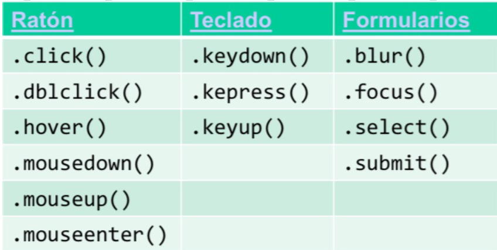

# Apuntes JavaScript
# Índice

1. [Elementos Básicos de JS](#elementos-básicos-de-js)
   - [Defer y Async](#defer-y-async)
   - [Interacción](#interacción)
   - [Variables y Constantes](#variables-y-constantes)
   - [Operadores](#operadores)
   - [Let vs Var](#let-vs-var)
   - [Conversiones](#conversiones)
   - [Condicionales](#condicionales)
   - [Funciones](#funciones)
   - [Objetos](#objetos)

2. [JQuery](#jquery)
   - [Uso de JQuery](#uso-de-jquery)
   - [Selectores](#selectores)
   - [Eventos](#eventos)
   - [CSS y Efectos](#css-y-efectos)
   - [Manipulación del DOM](#manipulación-del-dom)

3. [Strict Mode](#strict-mode)

4. [Módulos](#módulos)

5. [Clases](#clases)

6. [Ajax](#ajax)

7. [Promesas](#promesas)

8. [Fetch](#fetch)

9. [Async/Await](#asyncawait)


## Elementos Básicos de JS

### Defer y Async

#### `defer`
- Ejecuta el script *después* de cargar el HTML, pero antes de `DOMContentLoaded`.
- **Uso:** Para scripts que necesitan la estructura HTML. (Se cargan // con otros elem.)
- **Ejemplo:**
  ```html
  <script src="script.js" defer></script>
  ```

#### `async`
- Ejecuta el script *tan pronto* como se descargue, sin esperar al HTML.
- **Uso:** Para scripts independientes. (Se carga en // con otros scripts)
- **Ejemplo:**
  ```html
  <script src="script.js" async></script>
  ```

### Interacción
- Alert: Muestra mensaje al usuario
  ```javascript
  alert("¡Hola, usuario!");
  ```
- Pormpt: Pide al usuario que introduzca información 
  ```javascript
  let nombre = prompt("¿Cuál es tu nombre?");
  ```
- Confirm: le solicita al usuario que confirme
  ```javascript
  let confirmado = confirm("¿Estás seguro?");
  ```
- console.log: imprimir por consola
  ```javascript
  console.log("Mensaje en consola");
  ```

### Variables y constantes
- **let**: almacenamiento de datos con nombre
    + Puede cambiar de valor. 
    + Sintaxis: solo letras, dígitos, "$" y "_"
    + Puede cambiar de tipo de dato!
    ```javascript
    let message;
    console.log(typeof(message)) //undefined
    message = "Hello!"; 
    console.log(typeof(message)) //String
    message = 1234;
    console.log(typeof(message)) //Number

    //Declaración múltiple
    let user = "john", 
        age=25,
        message="hello!";
    ```
- **const**: no puede cambiar de valor 
    + No se pueden declarar dos veces
    + Se tiene que declarar antes de usarla
    + Para constantes conocidas, mejor usar mayúsculas y "_" 
    ```javascript
    const COLOR_RED = "#F00";
    ```

### Operadores

| **Tipo**         | **Operador**     | **Descripción**                     |
|------------------|------------------|-------------------------------------|
| **Aritméticos**  | `+`, `-`, `*`, `/`, `%`, `++`, `--` | Operaciones matemáticas            |
| **Asignación**   | `=`, `+=`, `-=`, `*=`, `/=` | Asignar valores                    |
| **Comparación**  | `==`, `===`, `!=`, `!==`, `>`, `<`, `>=`, `<=` | Comparar valores                  |
| **Lógicos**      | `&&`, "|", `!`  | AND, OR, NOT                       |
| **Condicional**  | `?:`             | Operador ternario (`cond ? expr1 : expr2`) |
| **Tipo**         | `typeof`, `instanceof` | Tipo de datos y tipo de objeto    |
| **Bitwise**      | `&`, "|", `^`, `~`, `<<`, `>>`, `>>>` | Operaciones a nivel de bits        |
| **Otros**        | `,`, `void`, `delete` | Coma, vaciar expresión, eliminar propiedad |

LEFT Shift: "<<" y ZERO-FILL Right Shift: ">>>"
```javascript
console.log(2**3) // 2^3, imprimirá 8
console.log(5 % 2) // Resto de 5/2, imprimirá 1
```

### Let vs Var
En general se recomienda **NO** usar var. 

| **Aspecto**                     | **`var`**                                                                 | **`let`**                                                             |
|----------------------------------|---------------------------------------------------------------------------|------------------------------------------------------------------------|
| **Alcance**                     | Tiene un alcance de función: es accesible dentro de toda la función donde fue declarada, sin importar el bloque. | Tiene un alcance de bloque: solo es accesible dentro del bloque donde se declaró (por ejemplo, dentro de un `if` o `for`). |
| **Re-declaración**              | Se puede redeclarar en el mismo ámbito sin errores.                        | No permite la redeclaración en el mismo ámbito (arroja un error).      |
| **Inicialización**              | Su valor es `undefined` por defecto si no se inicializa explícitamente.    | También es `undefined` por defecto, pero no se puede usar antes de ser declarada (zona temporal muerta). |
| **Hoisting**                    | Es "elevada" al inicio de su ámbito, pero su valor será `undefined` hasta que se inicialice. | También es elevada, pero no se puede acceder a ella antes de su declaración (zona temporal muerta). |
| **Ámbito global**               | Si se declara en el ámbito global, se convierte en una propiedad del objeto global (`window` en navegadores). | No se convierte en una propiedad del objeto global si se declara en el ámbito global. |
| **Bucles y closures**           | Puede causar problemas en bucles con closures debido a que no respeta el ámbito de bloque. | Se comporta correctamente en bucles, manteniendo el ámbito de bloque en cada iteración. |

- **Let** --> variable dentro del bloque. 
    ```javascript
    if(true){
        var test = TRUE;
    }
    alert(test); //TRUE

    if(true){
        let test = TRUE;
    }
    alert(test); // Reference Error: test is not defined
    ```

- **var** tiene scope de funciones:
    ```javascript
    function sayHi(){
        if(true){
            var phrase = "Hello!!!";
        }
        console.log(phrase); // Hello!!!
    }
    sayHi();
    cosole.log(phrase); // Reference Error: phrase is not defined
    ```

- **var** se puede redeclarar, **let** no. 
    ```javascript
    let user;
    let user;
    // SyntaxError: Identifier 'user' has already been declared

    var user = "pete";
    var user = "john";
    console.log(user); // john

- Con **var**, no hace falta poner "var" al declarar la variable.
    ```javascript
    user = "Pete";
    console.log(user); // Pete
    ```

- Las variables se pueden declarar después de su uso (*Hoisting*)

    + Las declaraciones de variables (con `var`, `let` o `const`) son "elevadas" al inicio de su contexto de ejecución, aunque su inicialización (asignación de valor) ocurre en el lugar donde está escrita.
    ```javascript
    console.log(x); // undefined
    var x = 5;
    console.log(x); // 5
    ```

    + Con `let` y `const`, el hoisting ocurre, pero no puedes usar la variable antes de su declaración (se genera un error de referencia).
    ```javascript
    let message;
    console.log(typeof(message)) //undefined
    message = "Hello!"; 
    // Esto SÍ con let

    console.log(typeof(mensaje)) // ReferenceError: Cannot access 'mensaje' before initialization
    let mensaje;
    // Esto NO con let
    ```

### Conversiones 
- Conversión a **String**:
    ```javascript
    console.log(String(null)); // 'null'
    ```
- Conversión a **Number**:
    ```javascript
    console.log(Number("23")+1); // 24
    console.log(Number("")); // 0
    console.log(Number("trece")); // NaN
    console.log(Number(true)); // 1 (false --> 0)

    // Usando "+"
    let apples = 2;
    let oranges = 3;
    console.log(+apples + +oranges); // 5
    ```
- Conversión usando **Boolean**:
    ```javascript
    console.log(Boolean(0)); // false
    console.log(Boolean(1)); // true
    console.log(Boolean(123)); // true
    console.log(Boolean("")); // false
    console.log(Boolean("arbolito")); // true
    console.log(Boolean(null)); // false, undefined tb
    ```
- Conversiones **explícitas**
    ```javascript
    console.log("2"+2); // 22
    console.log(4 + 5 + "px"); // 9px
    console.log("2"/"5"); // 0.4
    console.log("6" - 4); // 2
    console.log(True + 20); // 21
    console.log(True + "24"); // True24
    ```

### Condicionales 
- `if`: Evalúa si una condición es verdadera.
- `else`: Ejecuta si la condición del `if` es falsa.
- `else if`: Permite múltiples condiciones.
- `&&`: Verifica si ambas condiciones son verdadera (AND)
- `||`: Verifica si al menos una condición es verdadera.(OR)
- `!`: Niega una condición.
- Ternario: Condicional en una línea `condición ? true : false`.
    ```javascript
    x > 10 ? console.log("x es mayor que 10") : console.log("x es 10 o menos");

    // Sin else
    if (x > 10) console.log("x es mayor que 10");
    ```

- Etiquetas dentro de los bucles: 
    + **`break etiqueta`**: Sale del bucle etiquetado.
    + **`continue etiqueta`**: Salta a la siguiente iteración del bucle etiquetado.
    ```javascript
    // Ejemplo 1: `break` con etiqueta

    outerLoop: // Etiqueta para el bucle externo
    for (let i = 0; i < 5; i++) {
        for (let j = 0; j < 5; j++) {
            if (i === 3 && j === 3) {
                break outerLoop;  // Sale del bucle `outerLoop` (el bucle más externo)
            }
            console.log(i, j);
        }
    }


    // Ejemplo 2: `continue` con etiqueta
    outerLoop:
    for (let i = 0; i < 3; i++) {
        for (let j = 0; j < 3; j++) {
            if (i === 1 && j === 1) {
                continue outerLoop;  // Salta a la siguiente iteración del bucle `outerLoop`
            }
            console.log(i, j);
        }
    }

    ```
### Funciones 

#### `let` y `const` en funciones
- **`let`**: Se puede reasignar dentro de la función.
- **`const`**: No se puede reasignar dentro de la función.

```javascript
function ejemplo() {
    let x = 10;
    const y = 20;
    x = 15; // válido
    // y = 25; // Error: no se puede reasignar
}
```
- Las variables exreriores son accesibles y modificables

```javascript
let userName = "Paloma";
function printMessage(){
    userName = "Sol";
    let message = "Hola! " + userName;
    console.log(message)
}

console.log(userName); // Paloma
printMessage();
console.log(userName); // Sol
```
- Si se declara la misma variable dentro y fuera, la de dentro oscurece (*shadows*) la de fuera
```javascript
let userName = "Paloma";
function printMessage(){
    let userName = "Sol"; // hemos puesto LET !!!
    let message = "Hola! " + userName;
    console.log(message)
}

console.log(userName); // Paloma
printMessage();
console.log(userName); // Paloma
```

#### Expresión de función (función anónima)
```javascript
const multiplicar = function(a, b) {
    return a * b;
}
```

#### Arrow function
```javascript
const dividir = (a, b) => a / b;
```


#### Parámetros
- Se puede llamar a la función con menos parámetros y entonces se consideran *undefined*.
```javascript
function printMessage(from, text){
    console.log(from + ": " + text);
}
printMessage('Ann', 'hello!'); // Ann: hello!
printMessage('Ann', ); // Ann: Undefined
```
- También podemos incluir un valor por defecto
```javascript
function printMessage(from, text='no hay texto'){
    console.log(from + ": " + text);
}
printMessage('Ann', 'hello!'); // Ann: hello!
printMessage('Ann', ); // Ann: no hay texto

// Tb puede ser una llamada a otra
function printMessage(from, text= noText()){
    console.log(from + ": " + text);
}
printMessage('Ann', 'hello!'); // Ann: hello!
printMessage('Ann', ); // Ann: no hay texto
```

- Número variable de parámetros
```javascript
function sumarTodos(...numeros) { //...numeros: Recoge todos los parámetros pasados a la función en un array llamado "numeros"
    return numeros.reduce((acum, num) => acum + num, 0);
}

console.log(sumarTodos(1, 2, 3, 4));  // 10
console.log(sumarTodos(5, 10));       // 15
console.log(sumarTodos(7));           // 7

```
#### Expresiones
```javascript
let sayHi = function(){
    console.log("Hello");
}
console.log(sayHi); // Imprime el CÓDIGO de la función
console.log(sayHi()); // Hello\nundefined
```

Una **declaración de función** se puede usar **antes** de su definición debido al **hoisting** (elevación).

```javascript
sayHi("John");  // "Hello, John"

function sayHi(name) {
    alert(`Hello, ${name}`);
}

```

Una **expresión de función** no se puede usar **antes** de su definición, ya que se asigna a una variable en tiempo de ejecución.

```javascript
saludar("John");  // ReferenceError: saludar is not defined

let saludar = function(name) {
    alert(`Hello, ${name}`);
};
```

### Objetos 

#### 1. **Almacenar colecciones de datos**:
Un objeto puede almacenar varios tipos de datos como propiedades clave-valor.

```javascript
let persona = {
    nombre: "Juan",
    edad: 30
};
```

#### 2. **Acceder a la información**:
Puedes acceder a las propiedades con **notación de punto** o **corchetes**.

```javascript
console.log(persona.nombre);  // "Juan"
console.log(persona["edad"]); // 30
```

#### 3. **Añadir nuevas propiedades**:
Puedes agregar propiedades a un objeto en cualquier momento.

```javascript
persona.apellido = "Pérez";
persona["ciudad"] = "Madrid";
```

#### 4. **Borrar propiedades**:
Usa **`delete`** para eliminar propiedades de un objeto.

```javascript
delete persona.edad;
console.log(persona);  // { nombre: "Juan", apellido: "Pérez", ciudad: "Madrid" }
```

#### 5. **Comprobar si existe una propiedad**:
Usa **`in`** para verificar si una propiedad existe en el objeto.

```javascript
console.log("nombre" in persona); // true
console.log("edad" in persona);   // false
```

#### 6. **Recorrer objetos**:
Usa **`for...in`** para recorrer todas las propiedades de un objeto.

```javascript
for (let key in persona) {
    console.log(key + ": " + persona[key]);
}
```

#### 7. **Objetos anidados**:
Los objetos pueden contener otros objetos como propiedades.

```javascript
let empleado = {
    nombre: "Ana",
    direccion: {
        calle: "Calle Falsa 123",
        ciudad: "Barcelona"
    }
};
console.log(empleado.direccion.ciudad); // "Barcelona"
```

### API
Hay muchas interfaces y APIs definicdas

- Objeto window:
    + Variable global disponible en el navegador
    + Ofrece muchos métodos y objetos accesibles sin necesidad de usar el objeto windows
    + document: el documento HTML
    + `alert()`, `prompt()`, ...
    + Información sobre la ventana: `screenX`, `screenY`, `scrollY`, `scrollX`, ...
- Propiedad `onload`
    ```javascript
    // Para cuando el recurso se ha cargado
    window.addEventListener('load', (event){
        init();
    });

    // Alternativamente pero no recomendable
    window.onload = function(){
        init();
    }
    ```
- Propiedad `onclick`
    ```html
    <button id="boton"> Click Me </button>
    
    <script>
        let element = document.getElementById("boton");
        element.addEventListener("click", myScript);
        // Alternativa
        element.onclick = function(){myScript};
   </script>
    ```
- Acceder al documento
    ```javascript
        let markup = document.documentElement.innerHTML;

        //Acceder a elementos
        let myElement = document.getElementById("boton");
        let myElement = document.getElementsTagName("p");
        let myElement = document.getElementsByClassName("intro");
        let myElement = document.querySelectorAll("p.intro");

        //Añadir nuevos elementos
        let newElement = document.getElementById("new");
        newElement.appendChild(tag);
    ```

### Callback 
Función que se pasa como argumento a otra función y que se ejecuta después de que la función principal haya terminado su tarea. Pueden ser síncronas (habitualmente son asíncronas). 

```javascript
// Función principal
function hacerTarea(tarea, callback) { // arg --> una f(x) "callback"
  console.log(`Haciendo la tarea: ${tarea}`);
  callback();
}

// Este será ese "callback"
function notificarFin() {
  console.log("Tarea terminada.");
}

hacerTarea("Lavar los platos", notificarFin); // callback = notificarFin()

```

### Input
- Teclado
    + `keydown`: pulsar tecla
    + `keypress`: mientras se pulsa (puede haber N pulsadas a la vez)
    + `keyup`: cuando se libera la tecla

    ```javascript
    // Evento keyup: cuando la tecla se suelta
    document.addEventListener('keyup', function(event) {
    console.log(`Tecla liberada: ${event.key}`);
    });
    ```
- Ratón
    + `click`
    + `doubleclick`
    + `mouseup`: cuando se libera el botón del ratón
    + `mousedown`: pulsar el botón del ratón
    + `mousemove`: mientras se mieve el ratón

### Canvas
Por defecto es un rectángulo blanco:
```javascript
<canvas id="myCanvas" width="500" height="500"> Texto por si falla el navegador </canvas>

<script>
    let canvas = document.getElementById("myCanvas");
    let ctx = canvas.getContext("2d");
</script>
```

#### Formas
- Dibujar una línea
    ```javascript
    ctx.moveTo(0,0); // Mover el "lápiz" a las coordenadas
    ctx.lineTo(200,100); // Dibujar una línea desde (0,0) hasta (200,100) 
    ctx.strokeStyle = 'blue'; // Definir color del contorno
    ctx.stroke(); // Dibujar el CONTORNO (trazar la línea)
    ```
- Dibujar una figura
  ```javascript
    //Triángulo
    ctx.moveTo(100,200); 
    ctx.lineTo(200,200); 
    ctx.lineTo(150,100);
    ctx.lineTo(100,200)
    ctx.fillStyle = 'red'; // Cambia el color de relleno a rojo
    ctx.fill(); // RELLENAR
    ```
- Dibujar un rectángulo
    ```javascript
    //strokeReact(x, y, width, height)
    ctx.strokeReact(50,50,100,50);
    ctx.fillRect(50,50,100,50); // Dibujar un rectángulo RELLENO
    ctx.clearRect(50,50,100,50); // BORRAR un rectángulo
    ```
- Dibujar un círculo
    ```javascript
    //arc(x, y, radius, startAngle, endAngle, counterclockwise (false o true, sentido de las agujas del reloj))
    ctx.beginPath();
    ctx.arc(95, 50, 40, 0, 2*Math.PI);
    ctx.stroke(); // ctx.fill();
    ```
- Añadir texto
    ```javascript
    ctx.font = "30px Arial";
    ctx.fillText("Hello World!!", 10, 50);
    // Añadir StrokeText
    ctx.strokeText("Hello World!!", 10, 50);
    ```
- Añadir imágenes
    ```javascript
    // drawImage(image, x, y [, width, height])
    let img = new Image();
    img.onload = function(){
        ctx.drawImage(img, 0,0);
    };
    img.src = 'img.png';
    ```
- Animaciones
    Para dibujar un frame necesitamos:
    1. Limpiar el canvas
    2. Dibujar los elementos que queramos 

    + Para controlar las animaciones contamos con:
    ```javascript
    setInterval(function[,delay]); // Invocar f(x) cada delay en milisegundos
    serTimeout(function[,delay]); // Invocar una f(x) una sola vez dentro de dealy milisegundos
    requestAnimationFrame(callback);
        // Ejecuta una animación antes del siguiente repaint del navegador
        // Se ejecuta una sola vez
        // la tasa de refreso es unas 60 veces por segundo, puede variar según el display y puede ser más lenta si el navegador está sobrecargado.
        // l
    ```

    ```javascript
   // Obtener el canvas y el contexto 2D
    const canvas = document.getElementById('miCanvas');
    const ctx = canvas.getContext('2d');

    // Variables para la animación
    let x = 0; // Posición horizontal del círculo
    const radius = 20; // Radio del círculo

    // Función para limpiar el canvas y dibujar el círculo
    function dibujarFrame() {
        // Limpiar el canvas antes de dibujar
        ctx.clearRect(0, 0, canvas.width, canvas.height);

        // Dibujar un círculo en la nueva posición
        ctx.beginPath();
        ctx.arc(x, 250, radius, 0, 2 * Math.PI);
        ctx.fillStyle = 'blue';
        ctx.fill();

        // Mover el círculo hacia la derecha
        x += 2; // Mover 2 px por frame

        // Si el círculo se sale del canvas, reiniciar su posición
        if (x > canvas.width) {
            x = 0;
        }

        // Llamar a requestAnimationFrame para el siguiente frame
        requestAnimationFrame(dibujarFrame);
    }

    // Iniciar la animación
    requestAnimationFrame(dibujarFrame);
    ```

---

## JQuery
- Librería de JavaScript --> Recorrer y manipular HTML + CSS
- Gestión de Eventos + Efectos y manipulaciones + Ajax
- Se puede descargar o añadir el link (header, si mi script hace referencia a JQuery y aún no está cargado --> errores)
```html
<script src="https://code.jquery.com/jquery-3.6.0.min.js" defer></script>
<script src="miScript" defer></script> 
```
### Uso JQuery
- Acceso mediante `$`
- Selector --> Elemento HTML sobre el que vamos a actuar
- Acción --> sobre el elemento
    ```javascript
    $(selector).action();
    $.action(); // Tb hay acciones que no requieren elementos
    ```


### Selectores
- `window`
- `document`
- `this`
- `Selectores css` 
    ```javascript 
    $.("p")
    ```
- `.containes(texto)` --> e.emento que contengan texto
    ```javascript
    $(":contains('ipsum')");
    $(`:contains('ipsum')`);
    $(":contains(`ipsum`)"); // NO devuelve el resultado esperado
    // Tb se puede usar con otros selectores
    $("p:contains('ipsum')");
    ```

### Eventos
- `.click(handler)` --> se ejec. f(x) handler cuando se hace click sobre el elemento
    ```html
    <button id="btnCambio">Cambiar color</button>
    <p id="parrafo">Este es un párrafo de texto.</p>

    <script>
        // Usar jQuery para cambiar el color del párrafo al hacer clic en el botón
        $(document).ready(function() {
            // Manejar el clic en el botón con id "btnCambio"
            $('#btnCambio').click(function() {
                // Cambiar el color del texto del párrafo
                $('#parrafo').css('color', 'red');
            });
        });
        </script>
    ```
    Cuidado con las funciones con argumentos: 
    ```javascript
    function info(mensaje){
        console.log(mensaje);
    }
    $("p").click(info("hola")); // ERROR

    // Hay que usar una f(x) anónima como wrapper
    $("p").click(function(){
        info("hola");
    });
    ```
- `$(handler)` --> se ejecuta cuando el Document Model Object (DOM) ha terminado de cargar
    + Punto de comienzo para ejecutar el JS
    + Pueden no haberse cargado los assets (img, vídeos, ...)
    ```javascript
    $(function(){
        console.log("Bienvenido");
    });
    ```
- `.on("load", handler)`--> se ejec cuando se ha terminado de cargar el elemento. (Puede ser "load", "click", "keydown", ...)
    ```javascript
    $(img).on("load",function(){
        console.log("Se ha cargado la imagen");
    });

    // $(window).on("load", handler)--> se ejec cuando se han terminado de cargar los assets de la página.
    $(window).on("load", function(){
        console.log("Bienvenido, ya está todo listo");
    });
    ```
- `.on(handler)` --> permite asociar N acciones
    ```javascript
    $("p").on({
        mouseenter: function(){
            $(this).css("background-color", "green");
        },
        mouseleave: function(){
            $(this).css("background-color", "red");
        },
        click: function(){
            $(this).css("background-color", "yellow");
        }
    });
    ```
    

#### Objeto Evento
- Propiedades del objeto evento
```javascript
e.pageX, e.PageY // Posición del ratón
e.type // Tipo de evento
e.taget // El elemnto HTML que inició el evento
e.timestamp // Tiempo desde que se cargó la página
```
- Funciones del objeto evento
```javascript
e.preventDefault() // Previene la acción por defecto
e.stopPropagation() // Evita que el evento se propague a los padres
```
### CSS
- Devolver el valor de una propiedad CSS `.css(propertyName)`
```javascript
$("p").css(background-color);
```
- Cambiar el valor de una propiedad CSS `.css(propertyName, value)`
```javascript
$("p").css(background-color, "red");
// Actualizar N a la vez
$("p").css({background-color, "red",
    "color": "white",
    "font-size": 24px }
);
```
- Añadir o eliminar la clase `.addClass(className)` y `.removeClass(className)`
- Añadir SI NO la tienen o eliminar SI la tiene `.toggleClass(className)`
- Más comandos:
    + `.hasClass(className)`
    + `.height()`
    + `.width()`
    + `.position()`

- Efectos CSS 
    + `.hide()` Ocultar elemento
    + `.show()` Mostrar elemento
    + `.toggle()` Mostrar elemento si está oculto o ocultarlo si está visible
    + `.fadeIn()` Mostrar con efecto fade
    + `.fadeOut()` Ocultar con efecto fade
    + `.fadeToggle()`
    + `.slideDown()` Desliza el elemento hacia abajo para mostrarlo
    + `.slideUp()` Desliza el elemento hacia abajo para ocultarlo
    + `.slideToggle()`

- Parámetros de los efectos: `$(selector).hide(speed, callback);`
    + `speed`: "slow", "fast", Número (milisegundos)
    + Se pueden encadenar múltiples efectos (`chaining`)
    ```javascript 
    $("p").css("color", "red")
        .slideUp(2000)
        .slideDown(30000);
    ```

### Manipulación del DOM
- `.html()`--> Devuelve el contenido del primer elemento de HTML
```javascript
console.log($("body").html());
```
- `.html(contenido)`--> Modifica el contenido de todos los elementos de HTML
```javascript
$("div").html("<span> Sin contenido </span>");
```
- `.text()`--> Devuelve el texto combinado de todos los elementos y sus descendientes (ignora etiquetas HTML)
```javascript
console.log($("body").text());
```
- `.text(texto)`--> Modifica el texto de todos los elementos de HTML (trata las etiquetas HTML como texto)
```javascript
$("p").text("<span> Sin contenido </span>");
```
- `val()`--> Devuelve el valor del primer elemento. Se usa con elementos de formulario (input, select, textarea, ...)
```javascript
console.log($("input").val());
```
- `val(valor)`--> Modifica el valor de todos los elementos HTML
```javascript
$("input").val("Prueba el texto");
```
- `atr(nombreAtributo)`--> Devuelve el valor del atributo HTML
```javascript
console.log($("a").attr("href"));
```
- `atr(nombreAtributo, valor)` --> Modifica el valor del atributo
```javascript
$("a").attr("href", "www.ceu.es");
```
- `.prepend(contenido)` / `.append(contenido)` --> Añade al principio/final de cada elemento HTML
```javascript
$("#p1").prepend("<span> Al principio </span>");
$("#p1").append("<span> Al final</span>");
// Tb puedes añadir N contenido
let txt1 = "<h1> Un Título </h1>";
let txt2 = "<h1> Otro Título </h1>";
$("body").append(txt1, txt2);
```
- `.before(contenido)` / `.after(contenido)` --> Añade al antes/detrás de cada elemento HTML
```javascript
$("#p1").before("<span> Delante </span>");
$("#p1").after("<span> Detrás </span>");
// Tb puedes añadir N contenido
let txt1 = "<h1> Un Título </h1>";
let txt2 = "<h1> Otro Título </h1>";
$("body").before(txt1, txt2);
```
- `remove()` --> Elimina los elem HTML + su contenido
```javascript
$("p").remove();
```
- `remove(selector)` --> Elimina los elem HTML + su contenido que cumplan con el selector
```javascript
$("p").remove(":contains('lorem')");
```
- `empty()` --> Vacía los elem HTML
```javascript
$("p").empty();
```
- `children()` --> Devuelve los hijos de los elem HTML
```javascript
$("body").children();
```
- `parent()` --> Devuelve el padre de los elem HTML
```javascript
$("a").parent();
```
- `siblings()` --> Devuelve los hermanos de los elem HTML
```javascript
$("#p1").siblings();
```
---
## Strict Mode
Variante restringifa de JS:
- La semántica es diferente
- Puede funcionar de forma diferente en los navegadores
- Cambios:
    + Elimina los fallos silenciosos --> para que manden errores
    + Soluciona fallos que dificultan la optmización
    + Prohibe sintaxis --> q pueda ser definida en futuras versiones ECMAscript
- Se usa automáticamente en modulos y className
- Para todo el script usar `"use strict";`

```javascript
function funcionSinStrict(){
    x = 10;
    console.log(x); // Se va a imprimir, x es una var
}

function funcionConStrict(){
    "use strict";
    try{
        x = 10; //Va a dar error porq x no está definido
    } catch(error){
        console.log("error en modo estricto: ", error.message)
    }
}

// NO se puede usar en una función con param por DEFECTO
function funcionConStrict(x=10){
    "use strict"; // ERROR
    console.log(x);
    
}
```
- No se pueden duplicar parámetros en una función
    ```javascript
    function funcDuplicados(x,x){ // ERROR
        console.log(x)
    }
    ```

### Módulos
- Separan el código en  bloques --> importar/exportar
- Archivos de extensión --> `.msj` y tb los `.js`
- Características:
    + Automáticamente usan modo stricto
    + Para usar otros módulos es necesario utlizar un módulo 
    + Sólo se ejecutan una vex (aunq lo hayas referenciado N veces)
    + Las características imoprtadas no están disponibles en el alcance global
    + Varibales globales --> sí están disponibles en los módulos

Para una funcion: 
```html
<head>
    <script type="module" src="main.js"> </script>
</head>
<!-- No hace falta defer, los módulos lo aplican automáticamente >
```

`mimodulo.js`
```javascript
export const nombre = "Paloma";

export function saludar(){
    console.log(`Hola, ${nombre})
}
```
`app.js`
```javascript
// Importar el módulo
import {nombre, saludar} from './mimodulo.js'; // AL principio o al final
console.log(nombre); // paloma
saludar(); // Hola, paloma
```

```javascript
import{nombre as name,saludar} from './mimodulo.js'; // se pueden renombrar
import * as Square from './mimodulo.js'; // Importar todo dentro de un objeto
console.log(Square.nombre); // paloma
```

### Clases 
- Plantilla para crear Objetos
- fFunciona como una función especual
- Basada en prototypes
- Se ejec en modo stricto

```javascript
class Persona{
    constructor(nombre, edad){
        this.nombre = nombre; // Field
        this.edad; // Field
        //this.#id = id; Atr PRIVADO
    }

    mostrarInfo(){
        console.log(`Nombre: ${this.nombre}, Edad: ${this.edad}`);    
    }
}

// Crear una persona
const persona1 = new Persona('paloma', 21);
persona1.mostrarInfo(); // Nombre: paloma, Edad: 21
```

Herencia con extend:
```javascript
class Estudiante extends Persona{
    constructor(nombre, edad, curso)
    // Llamamo al constructor de la clase base (Persona)
    super(nombre, edad);
    this.curso = curso; // Nuevo field
}
```

Class Expressions:
```javascript
const Animal = class{
    constructor(tipo){
        this.tipo = tipo;
    }
}
```

Gettters y Settters:
```javascript
class Persona{
    cosntructor(nombre, edad){
        this.nombre = nombre;
        this.edad = edad;
    }

    // Getter para el nombre
    get nombre(){
        return this._nombre;
    }

    set nombre(nuevoNombre){
        if(nuevoNombre.length > 0){
            this._nombre = nuevoNombre;
        }else{
            console.log("El nuevo nombre está vacío!!!");
        }
    }
}

//Uso
const persona2 = new Persona('Sol', 50);
console.log(persona2.nombre); // Imprime: "Undefined"
persona2.nombre = 'Constanza';
console.log(persona2.nombre); // Imprime: "Constanza"
```

---

## Ajax
Asynchronous JavaScript and XML
- No es una tecnología, es una integración de diferentes tecnologías (HTML/XML, CSS, JS, DOM, JSON, ...)
- Busca actualizar la información sin recargar la página
- `XMLHttpRequest` Obtiene datos de una URL (No solo sirve para XML)

```javascript
// 1. Generar el objeto de XMLHttpRequest
const xhr = XMLHttpRequest();

// 2. Asignar un callback para manejar la respuesta cuando la petición cambie de estado
xhr.onreadystatechange = function(){
    if(xhr.readyState == 4 && xhr.status == 200){ // "4" Completado y "200" Éxito
        conosle.log("Respuesta recibida: ", xhr.responseText);
    }
};

// 3. Inicializar la petición (Método, URL, asíncrono)
xhr.open("GET", "https://jsonplaceholder.typicode.com/posts", true);

// 4. Enviar la petición
xhr.send();
```

```javascript
// Más opciones
xhr.timeout
xhr.setRequestHeader
xhr.abort
xhr.error
xhr.timeout
```

Ejemplo con html
```html
<!DOCTYPE html>
<html lang="en">
<head>
    <meta charset="UTF-8">
    <meta name="viewport" content="width=device-width, initial-scale=1.0">
    <title>AJAX Example</title>
</head>
<body>
    <h1>Ejemplo de AJAX</h1>
    <button id="fetchData">Cargar datos</button>
    <div id="result"></div>

    <script>
        document.getElementById('fetchData').addEventListener('click', function() {
            // Crear un objeto XMLHttpRequest
            const xhr = new XMLHttpRequest();

            // Configurar la solicitud (método GET, URL del servidor)
            xhr.open('GET', 'https://jsonplaceholder.typicode.com/posts/1', true);

            // Configurar lo que se hace al completar la solicitud
            xhr.onload = function() {
                if (xhr.status === 200) {
                    const data = JSON.parse(xhr.responseText);
                    document.getElementById('result').innerHTML = `
                        <h2>${data.title}</h2>
                        <p>${data.body}</p>
                    `;
                } else {
                    document.getElementById('result').innerText = 'Error al cargar los datos.';
                }
            };

            // Enviar la solicitud
            xhr.send();
        });
    </script>
</body>
</html>
```
---

## Promise
Problema del callback: Se nos pueden anidar y puede ser un follón
Promesas:
- Objetos que representan q se completará una operación asíncrona
- Les asocias un callback en vez de pedírselo f(x) por f(x). 
- Estados: `Pending`, `Fullfilled`, `Rejected`

```javascript
// Simular una operación asíncrona con una promesa
function obtenerDatos() {
    return new Promise((resolver, rechazar) => {
        setTimeout(() => {
            const exito = true; // Cambia a false para simular un error
            if (exito) {
                resolver("Datos cargados correctamente");
            } else {
                rechazar("Error al cargar los datos");
            }
        }, 1000); // Simular 1 segundo de retraso
    });
}

// Usar la promesa
obtenerDatos()
    .then((resultado) => {
        console.log(resultado); // Si se resuelve
    })
    .catch((error) => {
        console.error(error); // Si se rechaza
    });
```

Encadenamiento (`chaining`) de promesas:
```javascript
function pasoUno() {
    return new Promise((resolver) => {
        setTimeout(() => {
            console.log("Paso 1: Datos iniciales obtenidos");
            resolver("Datos del paso 1");
        }, 1000);
    });
}

function pasoDos(datosDelPasoUno) {
    return new Promise((resolver) => {
        setTimeout(() => {
            console.log(`Paso 2: Procesando ${datosDelPasoUno}`);
            resolver("Resultados del paso 2");
        }, 1000);
    });
}

function pasoTres(datosDelPasoDos) {
    return new Promise((resolver) => {
        setTimeout(() => {
            console.log(`Paso 3: Finalizando con ${datosDelPasoDos}`);
            resolver("Proceso completo");
        }, 1000);
    });
}

// Encadenar las promesas
pasoUno()
    .then((resultadoUno) => {
        return pasoDos(resultadoUno);
    })
    .then((resultadoDos) => {
        return pasoTres(resultadoDos);
    })
    .then((resultadoTres) => {
        console.log(`Resultado final: ${resultadoTres}`);
    })
    .catch((error) => {
        console.error("Error en el proceso:", error);
    });

```

Ejecutar N promesas:
- Ejecución contínua si se han resuelto todo
- Falla en cuanto falla una
```javascript
// Simular promesas
function tarea(nombre, tiempo, falla = false) {
    return new Promise((resolver, rechazar) => {
        setTimeout(() => {
            if (falla) {
                rechazar(`Tarea ${nombre} falló`);
            } else {
                resolver(`Tarea ${nombre} completada`);
            }
        }, tiempo);
    });
}

// Crear un array de promesas
const promesas = [
    tarea("A", 1000), // Tarea A tarda 1 segundo
    tarea("B", 2000), // Tarea B tarda 2 segundos
    tarea("C", 1500, true), // Tarea C falla después de 1.5 segundos
    tarea("D", 500) // Tarea D tarda 0.5 segundos
];

// Ejecutar todas las promesas
Promise.all(promesas)
    .then((resultados) => {
        console.log("Todas las tareas completadas:", resultados);
    })
    .catch((error) => {
        console.error("Una de las tareas falló:", error);
    });
```

## Fetch 
- API para obtener recursos
- Evolución de XMLHttpRequest
- Basado en `promises`

```javascript
fetch("diccionario.txt")
    .then((result) => result.text())
    .then(processData);

function processData(result){
    let palabras = result.split("\n");
    console.log(palabras.length);
}
```

También te permite hacer un post
```javascript
const data = {name: 'paloma', surname:'Pérez de Madrid', age: 21}

const options = {
    method = "POST",
    headers = {"Content-Type": "application/json"}, 
    body = JSON.stringify(data)
}

const URL = "127.0.0.1:5002"
fetch(URL, options)
    .then((result) => console.log("Enviado con éxito"))
    .catch(e) => console.log("Error: ", e);
```

## Async/Await
- `Async` Asocia una función asíncrona a un nombre
```javascript
async function obtenerDatos(){
    const respuesta = await fetch("https://jsonplaceholder.typicode.com/posts/3")
    const datos = await repsuesta.json(); // COnvertir a JSON
    console.log(datos);
}
```
- `Await` permite usar código asíncrono con promesas como si fuera síncrono
    + Pausa la ejecución del resto del código hasta que se resuelva la promesa
    + Se pueda usar try/catch
    + Tiene que usarse **dentro** de una función async o en el TOP de un módulo

```javascript
async function esperarImprimir() {
    console.log("Esperando información...");
    
    // Simular la espera de datos con una promesa
    const info = await new Promise((resolver) => {
        let contador = 0;
        const intervalo = setInterval(() => {
            console.log("Hola");
            contador++;
            // Simula recibir la información después de 5 "Hola"
            if (contador === 5) {
                clearInterval(intervalo); // Detener "Hola"
                resolver("¡Información recibida!");
            }
        }, 1000); // cada segundo
    });

    
    console.log(info);
}


esperarImprimir();
```
Salida:
```bash
Esperando información...
Hola
Hola
Hola
Hola
Hola
¡Información recibida!
```

